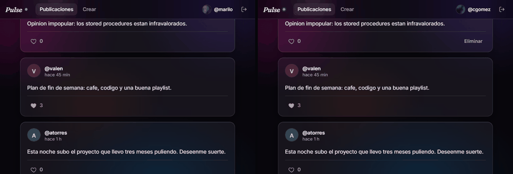
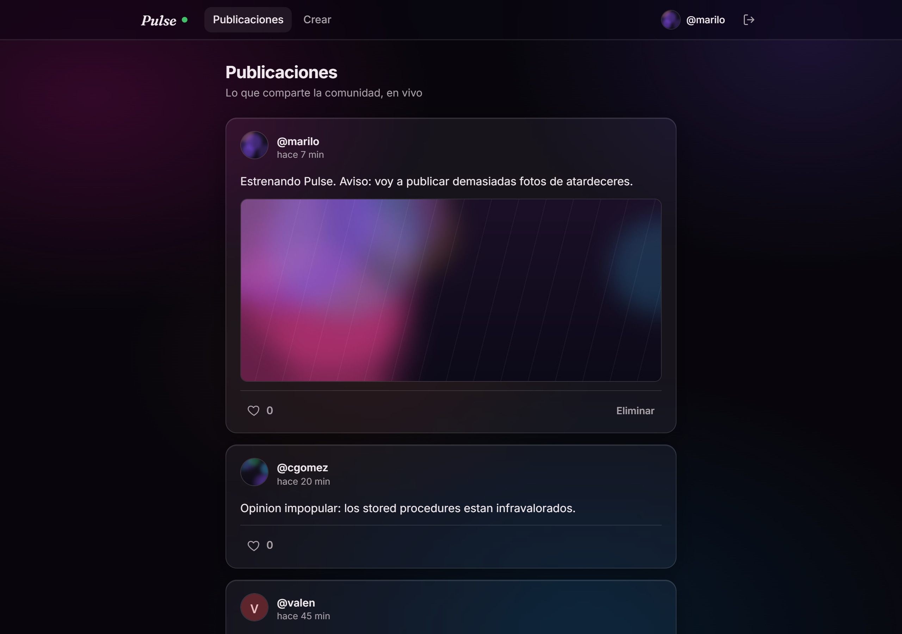
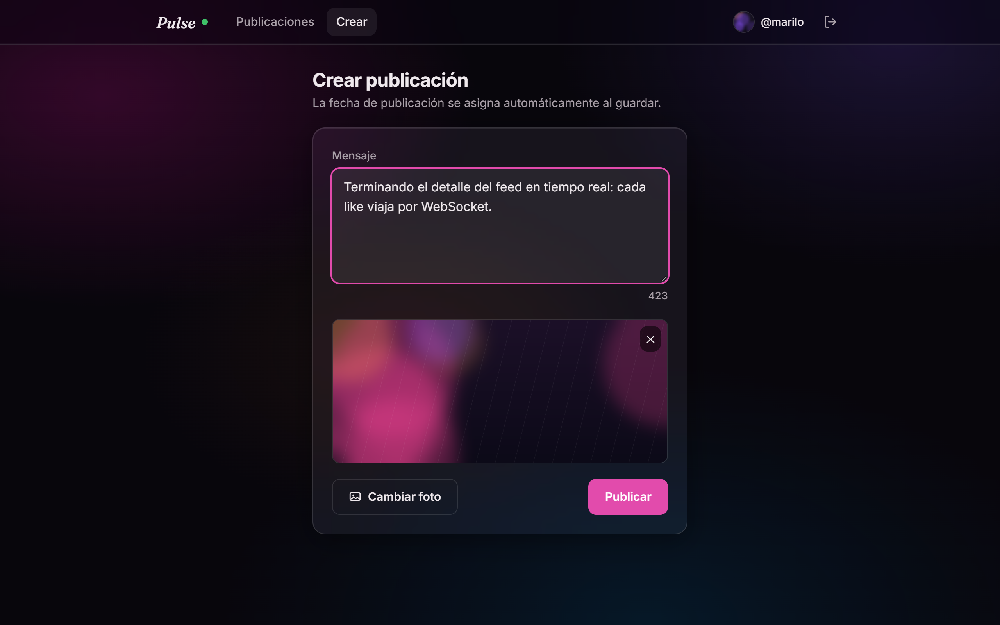
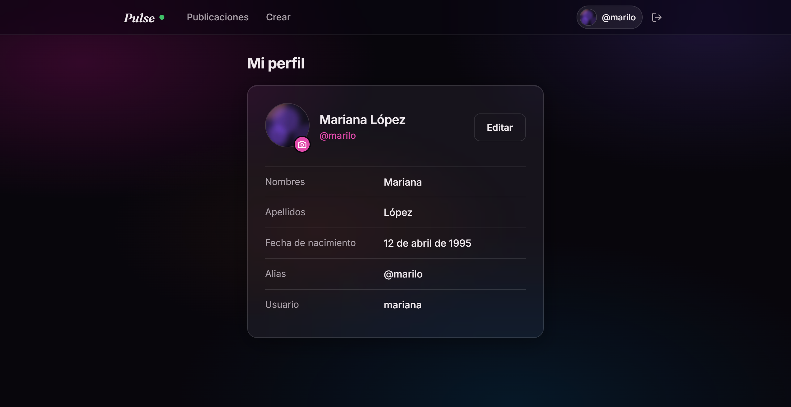
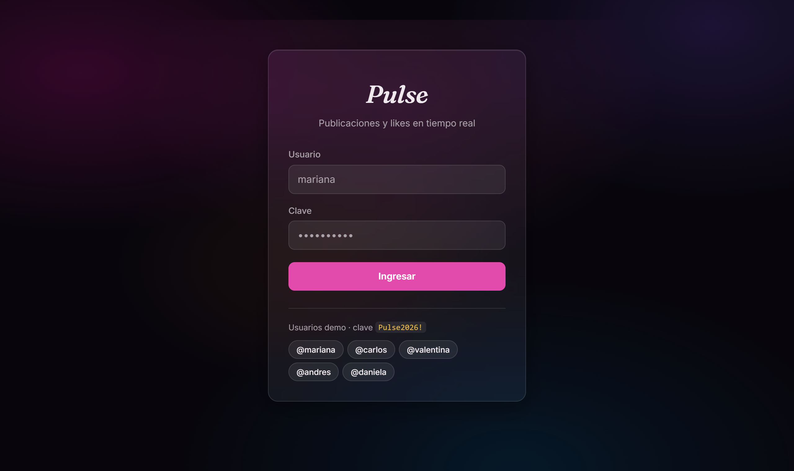
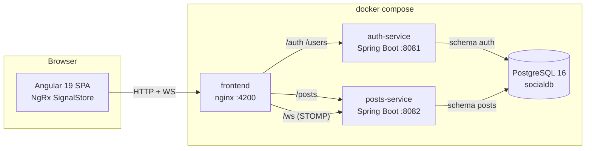

# Pulse — Real-time social network

[](https://github.com/drodriguezj12/pulse-social-network/actions/workflows/ci.yml)


A social network built as two Spring Boot microservices and an Angular SPA, where
**likes and new posts propagate to every connected browser in real time** over
WebSocket/STOMP. Users sign in with JWT, edit their profile and avatar, publish
posts with images, and delete their own content.

The whole stack — database, both services and the frontend — starts with a single
`docker compose up --build`.

> The user interface is in Spanish; the codebase, comments and documentation are in English.

---

## See it running

**[Watch the demo (90 seconds, no audio)](https://youtu.be/POKikhqDtYo)** — two
sessions running side by side: signing in, publishing a post with an image, editing a
profile, and a new post landing in the other browser on its own.

**Two browsers, side by side.** The window on the right clicks the like; the counter
on the left moves on its own. No polling, no reload — a STOMP frame lands and the
SignalStore updates every open feed:



| Feed — glass cards, avatars, live like counts | Composing a post with an image |
|---|---|
|  |  |

| Profile — editable alias and avatar | Sign in with the seeded demo users |
|---|---|
|  |  |

---

## What this project demonstrates

- **Microservice boundaries that hold up.** Two services, two database schemas, zero
  runtime calls between them — identity travels inside a self-contained JWT.
- **PostgreSQL beyond CRUD.** Real PL/pgSQL `PROCEDURE`s invoked with `CALL` from
  JDBC, a set-returning `FUNCTION` for the feed, keyset pagination on an index built
  for it, and idempotency enforced at the database level.
- **Real-time UX.** STOMP over WebSocket driving an NgRx SignalStore: likes, new posts
  and deletions all land without a reload, with optimistic updates reconciled against
  the server's authoritative count.
- **Tests that prove the hard parts.** 95 tests, including integration tests that run
  the stored procedures against a real PostgreSQL (Testcontainers) and real STOMP
  clients that wait for the broadcast frames.
- **Production hygiene.** Secrets with no committed fallback, a Content-Security-Policy
  and the usual hardening headers, Prometheus metrics, grouped Dependabot updates.
- **Reproducible delivery.** Multi-stage Docker images, health-gated Compose startup,
  Flyway-owned schema, CI on every push.

## Architecture



- **auth-service** (`:8081`) — JWT login, own profile and read-only profiles of other
  users, avatar upload. Sole owner of the `auth` schema.
- **posts-service** (`:8082`) — posts with optional images, likes backed by PL/pgSQL
  stored procedures, author-only deletion, and WebSocket broadcasting. Sole owner of
  the `posts` schema.
- **frontend** (`:4200`) — the Angular SPA served by nginx, which also proxies the API
  and the WebSocket so the browser talks to a single origin (no CORS).
- **PostgreSQL** — one instance, two independent schemas, one Flyway migration history
  per service.

## Quick start

Requirements: Docker Desktop (or Docker Engine + Compose v2). Java, Maven and Node are
only needed for local development.

```bash
git clone https://github.com/drodriguezj12/pulse-social-network.git
cd pulse-social-network
docker compose up --build
```

First run takes ~3–6 minutes (pulling images and dependencies). Then:

| Service | URL |
|---|---|
| **Application** | http://localhost:4200 |
| Swagger — auth-service | http://localhost:8081/docs |
| Swagger — posts-service | http://localhost:8082/docs |
| Health / metrics | http://localhost:8081/actuator/health · http://localhost:8082/actuator/health |

Stop everything with `docker compose down` (add `-v` to wipe the database).

### Demo users

On startup the services seed a feed worth looking at: five BCrypt users (two with a
profile picture), two dozen posts spread over the last few days, one of them
illustrated, and fifty likes between them. The same data ships as a standalone script
in [`db/seed.sql`](db/seed.sql).

| Username | Password | Alias |
|---|---|---|
| `mariana` | `Pulse2026!` | @marilo |
| `carlos` | `Pulse2026!` | @cgomez |
| `valentina` | `Pulse2026!` | @valen |
| `andres` | `Pulse2026!` | @atorres |
| `daniela` | `Pulse2026!` | @danim |

**To see the real-time behaviour**, open http://localhost:4200 in two browsers (or a
normal and an incognito window), sign in as two different users and put them side by
side. Liking a post moves the counter in both windows; publishing a post makes it
appear in the other feed instantly.

## Technical decisions

### PROCEDURE vs FUNCTION in PostgreSQL

PostgreSQL distinguishes `PROCEDURE` (PG11+, invoked with `CALL`, supports `INOUT`
parameters) from `FUNCTION` (returns values or rows, used inside queries). Returning a
result set from a procedure is impractical, so each routine uses the idiomatic form:

| Routine | Type | Invoked from Java as |
|---|---|---|
| `sp_register_like(post, user, INOUT total)` | **PROCEDURE** | `CallableStatement` with `{call ...}` |
| `sp_remove_like(post, user, INOUT total)` | **PROCEDURE** | `CallableStatement` with `{call ...}` |
| `sp_get_posts_with_likes(current_user)` | FUNCTION (`RETURNS TABLE`) | `SELECT * FROM ...` |

One subtlety worth knowing: the PostgreSQL JDBC driver translates the `{call ...}`
escape into `SELECT` by default, which fails against a procedure. The datasource URL
carries `escapeSyntaxCallMode=callIfNoReturn` so the driver emits `CALL` instead.
Integration tests execute the procedures for real, so this stays honest.

### Keyset pagination instead of OFFSET

`OFFSET` pagination degrades linearly — the database still walks and discards every
skipped row — and it is unstable: posts published while someone reads shift the window,
so items get duplicated or skipped between pages. The feed pages by cursor instead: the
client sends back the `(published_at, id)` of the last post it received, and the query
seeks straight to that position with a row-value comparison against an index built on
the same sort key.

The cursor travels as one opaque Base64 token rather than two query parameters, so
clients just echo what the previous page returned and the sort key can change later
without breaking the contract.

### Like idempotency, enforced twice

A composite primary key `(post_id, user_id)` on the `likes` table makes a duplicate
like physically impossible, and `INSERT ... ON CONFLICT DO NOTHING` inside
`sp_register_like` makes a repeated request a no-op that still returns the correct
total. One user counts once; the counter grows when *different* users like a post.

### Stateless JWT, no inter-service calls

`auth-service` issues an HS256 token carrying `sub`, `username` and `alias`;
`posts-service` validates it with the same shared secret. No service-to-service call
is ever made to authorize a request. RS256 with JWKS would be the next step once more
services join — for two services it would be overhead.

### Denormalized alias with lazy synchronization

Posts store `author_alias` denormalized from the JWT, so rendering the feed never
requires a call to `auth-service`. When a user edits their alias, `PUT /users/me`
re-issues the JWT with the new value, and the next feed load runs an `UPDATE` that
syncs the alias on that user's existing posts. The token carries the change; no broker
or distributed transaction needed.

### Images in the database, deliberately

Avatars and post images live as `BYTEA` in dedicated tables (`user_avatars`,
`post_images`), so loading a user or listing the feed never drags image bytes into
memory. This keeps the deployment to a single `docker compose up` with no object
storage to provision. At real volume the exchange is a well-understood one: swap the
image repository for an S3/MinIO client — nothing else in the codebase changes.

The read endpoints are public on purpose: `` tags cannot attach an
`Authorization` header. Only image bytes are exposed, addressed by UUID; profile data
and the feed stay behind the JWT.

### Broadcast-only WebSocket

The `/ws` handshake is open because the channel only *broadcasts* information any
authenticated user already sees in the feed: like totals, new posts and deletions.
Every mutation goes through REST with a JWT. Securing the handshake (token in the
CONNECT frame) would be the hardening step if the channel ever carried private data.

### No secret with a fallback

Neither service defines a default `JWT_SECRET`: the application fails to start without
one, so a deployment can never silently run on a value that is readable in this
repository. The Compose file supplies a clearly-labelled local value so
`docker compose up` still works for a demo out of the box.

### An avatar for everyone

`GET /users/{id}/avatar` never 404s for an existing user: when there is no uploaded
picture it returns a generated SVG disc with the user's initial, coloured from a hash
of their alias. Clients need no fallback branch, every `` in the feed resolves,
and the browser console stays clean.

### Separable monorepo

`backend/` and `frontend/` are fully independent projects with their own builds,
Docker images and READMEs. They can stay in one repository or be split into two
without touching a line of code.

## API

### auth-service (`:8081`)

```bash
# Login
curl -s -X POST http://localhost:8081/auth/login \
  -H "Content-Type: application/json" \
  -d '{"username":"mariana","password":"Pulse2026!"}'

TOKEN=$(curl -s -X POST http://localhost:8081/auth/login -H "Content-Type: application/json" \
  -d '{"username":"mariana","password":"Pulse2026!"}' | python -c "import sys,json;print(json.load(sys.stdin)['token'])")

# Own profile / another user's profile (read-only)
curl -s http://localhost:8081/users/me -H "Authorization: Bearer $TOKEN"
curl -s http://localhost:8081/users/00000000-0000-0000-0000-000000000002 -H "Authorization: Bearer $TOKEN"

# Edit alias (re-issues the JWT); username and real names are immutable.
# Aliases are unique, case insensitively: a clash answers 409.
curl -s -X PUT http://localhost:8081/users/me -H "Authorization: Bearer $TOKEN" \
  -H "Content-Type: application/json" -d '{"alias":"mariana_live"}'

# Upload an avatar (JPEG/PNG/WebP, max 2MB) and read it back. The read is public
# (for img tags) and returns a generated SVG disc when there is no upload.
curl -s -X PUT http://localhost:8081/users/me/avatar -H "Authorization: Bearer $TOKEN" \
  -F "image=@photo.png;type=image/png"
curl -s http://localhost:8081/users/00000000-0000-0000-0000-000000000001/avatar -o avatar.png
```

`GET /auth/login` is also available, accepting credentials as query parameters or as
`X-Username` / `X-Password` headers. `POST` is the one the frontend uses: credentials
in a URL leak into access logs, proxies and browser history.

### posts-service (`:8082`)

```bash
# Feed: one page of posts with like totals and whether the current user liked each.
# Response: { "items": [...], "nextCursor": "…" | null }
curl -s "http://localhost:8082/posts?limit=10" -H "Authorization: Bearer $TOKEN"

# Next page: echo back the nextCursor from the previous response
curl -s "http://localhost:8082/posts?limit=10&cursor=<nextCursor>" -H "Authorization: Bearer $TOKEN"

# Create a post — publication date is assigned server-side on save
curl -s -X POST http://localhost:8082/posts \
  -H "Authorization: Bearer $TOKEN" -H "Content-Type: application/json" \
  -d '{"message":"Hello Pulse!"}'

# Create a post with an image (multipart, max 2MB) and read the image back
curl -s -X POST http://localhost:8082/posts -H "Authorization: Bearer $TOKEN" \
  -F "message=With a photo" -F "image=@photo.png;type=image/png"
curl -s http://localhost:8082/posts/{postId}/image -o post.png

# Like (idempotent) and unlike — both broadcast the new total over WebSocket
curl -s -X POST   http://localhost:8082/posts/{postId}/likes -H "Authorization: Bearer $TOKEN"
curl -s -X DELETE http://localhost:8082/posts/{postId}/likes -H "Authorization: Bearer $TOKEN"

# Delete your own post (someone else's returns 403); broadcast to every open feed
curl -s -X DELETE http://localhost:8082/posts/{postId} -H "Authorization: Bearer $TOKEN"

# After renaming yourself in auth-service, realign the alias denormalized on your posts
curl -s -X POST http://localhost:8082/posts/author-alias -H "Authorization: Bearer $TOKEN"
```

Both services return consistent errors through `@RestControllerAdvice`:

```json
{ "timestamp": "…", "status": 404, "error": "Not Found", "message": "Post not found", "path": "/posts/…/likes" }
```

### WebSocket

STOMP endpoint: `ws://localhost:8082/ws` (or `ws://localhost:4200/ws` through nginx).

| Topic | Payload | Emitted when |
|---|---|---|
| `/topic/likes` | `{ "postId": "…", "likeCount": 3 }` | Any like or unlike |
| `/topic/posts` | the full `PostResponse` | A post is created |
| `/topic/posts-deleted` | `{ "postId": "…" }` | A post is deleted |

## Tests

95 tests in total: 31 backend unit tests, 38 backend integration tests and 26 frontend
specs.

```bash
# Backend — from backend/auth-service or backend/posts-service
mvn test     # unit tests (JUnit 5 + Mockito), no Docker required
mvn verify   # + integration tests (Testcontainers with a real PostgreSQL)

# Frontend — from frontend/
npm run test:ci
```

Integration tests cover the parts that would be dishonest to mock: Flyway migrations,
the stored procedures executing for real (a like sent twice leaves exactly one row),
like counts accumulating across different users, cursor pagination walked page by page
until the pages provably cover the whole feed without overlap, unique aliases under a
case-insensitive index, the full image lifecycle, author-only deletion, and STOMP
clients that connect and wait for the actual broadcast frames.

Unit tests use Mockito against in-memory doubles; H2 was deliberately not used, since
it cannot execute PL/pgSQL and a test that skips the procedures would prove nothing.

## Project structure

```
├── docker-compose.yml        # PostgreSQL + both services + frontend
├── db/seed.sql               # predefined users and posts
├── backend/
│   ├── auth-service/         # JWT login + profiles (schema auth)
│   └── posts-service/        # posts + likes + WebSocket (schema posts)
└── frontend/                 # Angular 19 + NgRx SignalStore + nginx
```

## Possible next steps

Known trade-offs I would revisit before calling this production-ready: refresh tokens
with a shorter access-token lifetime, rate limiting on login, object storage for images
once they outgrow a single database, validating uploaded images by their magic bytes
and re-encoding them server-side (which also strips EXIF), and an external STOMP broker
so broadcasts still reach everyone once the service runs as more than one instance.

## License

MIT — see [LICENSE](LICENSE).

Built by **Daniel Rodriguez** ([GitHub](https://github.com/drodriguezj12) ·
[LinkedIn](https://www.linkedin.com/in/daniel-rodriguez-b795a8406/)).
