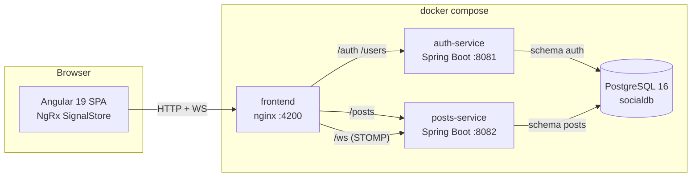

# Pulse — Red social en tiempo real

Prueba técnica Full Stack (Angular + Java) · **Java 21 · Spring Boot 3.3 · Angular 19 · PostgreSQL 16 · Docker**

Pulse es una red social con arquitectura de microservicios: autenticación JWT,
perfiles con **foto y alias editable**, publicaciones **con imagen opcional**, y
**tiempo real** vía WebSocket (STOMP): tanto los likes como las publicaciones nuevas
aparecen en todos los navegadores conectados sin recargar. Todo el stack se levanta
con un solo comando de Docker Compose.

---

## Arquitectura



- **auth-service** (`:8081`): login JWT y perfil. Dueño exclusivo del schema `auth`.
- **posts-service** (`:8082`): publicaciones, likes (stored procedures PL/pgSQL) y
  difusión en tiempo real por WebSocket. Dueño exclusivo del schema `posts`.
- **frontend** (`:4200`): SPA Angular servida por nginx, que además hace proxy de
  API y WebSocket — un solo origen, sin CORS.
- **PostgreSQL**: una instancia, dos schemas independientes (uno por servicio),
  migraciones con Flyway por servicio.

## Ejecución (un comando)

Requisitos: Docker Desktop (o Docker Engine + Compose v2). Nada más — Java, Maven,
Node y Angular solo hacen falta para desarrollo local.

```bash
docker compose up --build
```

Primer arranque: ~3–6 min (descarga imágenes y dependencias). Cuando termine:

| Servicio | URL |
|---|---|
| **Aplicación (frontend)** | http://localhost:4200 |
| Swagger auth-service | http://localhost:8081/docs |
| Swagger posts-service | http://localhost:8082/docs |
| Salud / métricas auth | http://localhost:8081/actuator/health · /actuator/metrics |
| Salud / métricas posts | http://localhost:8082/actuator/health · /actuator/metrics |

Para detener todo: `docker compose down` (agrega `-v` para borrar también la base de datos).

## Usuarios demo (seeder)

Al iniciar, `auth-service` crea 5 usuarios (BCrypt) y `posts-service` una publicación
por usuario. El mismo contenido está en [`db/seed.sql`](db/seed.sql) como entregable.

| Usuario | Clave | Alias |
|---|---|---|
| `mariana` | `Pulse2026!` | @marilo |
| `carlos` | `Pulse2026!` | @cgomez |
| `valentina` | `Pulse2026!` | @valen |
| `andres` | `Pulse2026!` | @atorres |
| `daniela` | `Pulse2026!` | @danim |

**Demo de tiempo real**: abre http://localhost:4200 en dos navegadores (o una ventana
normal y una de incógnito), inicia sesión con dos usuarios distintos y da like a una
publicación — el contador se actualiza en ambos al instante, sin recargar.

## Decisiones técnicas

### Login con GET (enunciado) vs POST (buena práctica)
El enunciado pide literalmente `login con JWT (GET)`. Se implementaron **ambos**:
`POST /auth/login` (recomendado: las credenciales viajan en el body) y
`GET /auth/login` para cumplimiento literal, aceptando credenciales por query params
o por headers `X-Username` / `X-Password`. Un GET con credenciales en la URL las
expone en logs de servidores/proxies e historial del navegador; por eso el frontend
usa el POST y el GET queda documentado en Swagger.

### PROCEDURE vs FUNCTION en PostgreSQL (mínimo 2 PROCEDURE)
PostgreSQL distingue `PROCEDURE` (PG11+, se invoca con `CALL`, admite `INOUT`) de
`FUNCTION` (retorna valores/filas y se usa en consultas). Como retornar result sets
desde una PROCEDURE es poco práctico, el diseño usa **las tres rutinas** donde cada
una es idiomática:

| Rutina | Tipo | Invocación desde Java |
|---|---|---|
| `sp_register_like(post, user, INOUT total)` | **PROCEDURE** | `CallableStatement` con `{call ...}` |
| `sp_remove_like(post, user, INOUT total)` | **PROCEDURE** | `CallableStatement` con `{call ...}` |
| `sp_get_posts_with_likes(current_user)` | FUNCTION (`RETURNS TABLE`) | `SELECT * FROM ...` |

Detalle importante: el datasource de posts-service lleva
`escapeSyntaxCallMode=callIfNoReturn` para que el driver JDBC emita `CALL`
(procedure) y no `SELECT` (function). La ejecución real de las procedures está
cubierta por tests de integración.

### Idempotencia de likes
Doble garantía: clave primaria compuesta `(post_id, user_id)` en la tabla `likes` +
`INSERT ... ON CONFLICT DO NOTHING` dentro de `sp_register_like`. Dar like dos veces
no duplica y retorna el mismo total.

### JWT HS256 con secreto compartido
`auth-service` emite el token; `posts-service` lo valida con el mismo secreto
(variable de entorno `JWT_SECRET`). Así cada request se autoriza sin llamadas entre
servicios. En producción se rotaría a RS256 + JWKS; para este alcance sería
sobre-ingeniería (trade-off documentado).

### Sin acoplamiento entre microservicios
`posts-service` guarda `author_alias` **denormalizado** (tomado del JWT al crear la
publicación): el feed nunca llama a `auth-service`. No hay FK entre schemas — cada
servicio es dueño absoluto de sus datos y podría extraerse a su propia base sin
cambios de código.

### WebSocket de solo difusión
El handshake de `/ws` es abierto: por ese canal **solo se difunden** totales de likes
(dato público); toda mutación pasa por REST con JWT. Los clientes se suscriben a
`/topic/likes` y reciben `{postId, likeCount}`.

### Monorepo separable
`backend/` y `frontend/` son proyectos 100% independientes (build, Docker y README
propios). Pueden subirse como un solo repositorio o dividirse en dos sin tocar nada.

## API

### auth-service (`:8081`)

```bash
# Login (recomendado)
curl -s -X POST http://localhost:8081/auth/login \
  -H "Content-Type: application/json" \
  -d '{"username":"mariana","password":"Pulse2026!"}'

# Login GET — cumplimiento literal del enunciado (query params o headers)
curl -s "http://localhost:8081/auth/login?username=mariana&password=Pulse2026!"
curl -s http://localhost:8081/auth/login -H "X-Username: mariana" -H "X-Password: Pulse2026!"

# Perfil del usuario autenticado
TOKEN=$(curl -s -X POST http://localhost:8081/auth/login -H "Content-Type: application/json" \
  -d '{"username":"mariana","password":"Pulse2026!"}' | python -c "import sys,json;print(json.load(sys.stdin)['token'])")
curl -s http://localhost:8081/users/me -H "Authorization: Bearer $TOKEN"

# Editar alias del perfil (username y nombre real son inmutables por diseño)
curl -s -X PUT http://localhost:8081/users/me -H "Authorization: Bearer $TOKEN" \
  -H "Content-Type: application/json" -d '{"alias":"mariana_live"}'

# Subir foto de perfil (JPEG/PNG/WebP, máx 2MB) y leerla (pública, para tags img)
curl -s -X PUT http://localhost:8081/users/me/avatar -H "Authorization: Bearer $TOKEN" \
  -F "image=@foto.png;type=image/png"
curl -s http://localhost:8081/users/00000000-0000-0000-0000-000000000001/avatar -o avatar.png
```

### posts-service (`:8082`)

```bash
# Feed: publicaciones de OTROS usuarios con total de likes (vía sp_get_posts_with_likes)
curl -s http://localhost:8082/posts -H "Authorization: Bearer $TOKEN"

# Crear publicación (fecha asignada por el servidor al guardar)
curl -s -X POST http://localhost:8082/posts \
  -H "Authorization: Bearer $TOKEN" -H "Content-Type: application/json" \
  -d '{"message":"Hola Pulse!"}'

# Crear publicación CON imagen (multipart; JPEG/PNG/WebP máx 2MB) y leer la imagen
curl -s -X POST http://localhost:8082/posts -H "Authorization: Bearer $TOKEN" \
  -F "message=Con foto" -F "image=@foto.png;type=image/png"
curl -s http://localhost:8082/posts/{postId}/image -o post.png

# Dar like (idempotente, vía sp_register_like) — difunde el total por WebSocket
curl -s -X POST http://localhost:8082/posts/10000000-0000-0000-0000-000000000002/likes \
  -H "Authorization: Bearer $TOKEN"

# Quitar like (vía sp_remove_like)
curl -s -X DELETE http://localhost:8082/posts/10000000-0000-0000-0000-000000000002/likes \
  -H "Authorization: Bearer $TOKEN"
```

Errores consistentes en ambos servicios (`@RestControllerAdvice`):

```json
{ "timestamp": "…", "status": 404, "error": "Not Found", "message": "Post not found", "path": "/posts/…/likes" }
```

### WebSocket

Endpoint STOMP: `ws://localhost:8082/ws` (o `ws://localhost:4200/ws` vía nginx).

| Tópico | Payload | Cuándo |
|---|---|---|
| `/topic/likes` | `{ "postId": "…", "likeCount": 3 }` | Cada like/unlike |
| `/topic/posts` | la publicación completa (`PostResponse`) | Cada publicación nueva — los feeds abiertos la muestran al instante |

## Tests

Backend (por servicio, desde `backend/auth-service` o `backend/posts-service`):

```bash
mvn test     # unitarios (JUnit 5 + Mockito), sin Docker
mvn verify   # + integración (Testcontainers + PostgreSQL real; requiere Docker)
```

Cobertura de integración destacada: flujo completo de login y perfil, inclusión de
publicaciones propias en el feed, **ejecución real de las stored procedures**
(idempotencia del like verificada contra la BD), acumulación de likes entre
usuarios distintos, ciclo completo de imágenes (subida multipart, lectura pública,
validación de tipo) y **clientes STOMP reales** que reciben los broadcasts de
likes y de publicaciones nuevas.

Frontend: `npm test -- --watch=false --browsers=ChromeHeadless` (18 specs Karma/Jasmine:
stores, guards, pipes, likes optimistas con reversión y llegada de posts por WebSocket).

## Estructura

```
├── docker-compose.yml        # Postgres + 2 microservicios + frontend
├── db/seed.sql               # usuarios y publicaciones predefinidos (entregable)
├── backend/
│   ├── auth-service/         # login JWT + perfil (schema auth)
│   └── posts-service/        # posts + likes + WebSocket (schema posts)
├── frontend/                 # Angular 19 + NgRx SignalStore + nginx
└── INSTALACION.md / .pdf     # guía de instalación y explicación del proyecto
```

## Autor

Daniel Rodriguez — prueba técnica Full Stack para Periferia IT Group.
